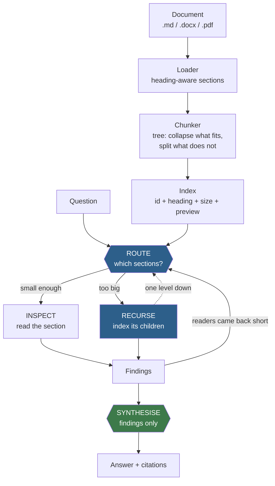

# RLM — a minimal Recursive Language Model

A small, readable implementation of one idea: **instead of pushing a whole document into a model's context, let the model navigate the document.**

The model never sees the document. It sees a *table of contents* — one line per section with an id, a heading path, a size and a short preview — and decides which sections are worth reading. A section small enough gets read in full. A section too big gets **descended into**, which repeats the same decision one level down. At the end, only the findings are combined into an answer.

The cost of that is proportional to **what the model chose to read**, not to how large the document is.

```
$ python -m app --question "What does SAP charge for indirect access?"

[RLM] chunk: 26 chunks, 7769 tokens, tree depth 3, leaf target 600
[RLM] working context budget 1500 tok < document 7769 tok -> recursive mode
...
[RLM] read 1,639 of 7,769 document tokens (21.1%)
```

> **This is an educational implementation.** It follows the RLM *idea* — recursive decomposition of a prompt the model treats as an environment rather than as tokens in its window — in a few hundred readable lines of Python. It is not a reimplementation of the paper's system, and it does not reproduce the paper's benchmarks. See [Relationship to the paper](#relationship-to-the-paper).

---

## Contents

- [Background: the RLM paper](#background-the-rlm-paper)
- [Why this matters even when the document fits](#why-this-matters-even-when-the-document-fits)
- [Architecture](#architecture)
- [How the recursion works](#how-the-recursion-works)
- [The working context budget](#the-working-context-budget)
- [Example run](#example-run)
- [Install](#install)
- [Configuration](#configuration)
- [Running it](#running-it)
- [Tests](#tests)
- [Relationship to the paper](#relationship-to-the-paper)
- [Design decisions](#design-decisions)
- [Limitations](#limitations)
- [Where to take it next](#where-to-take-it-next)

---

## Background: the RLM paper

The concept comes from **"Recursive Language Models"** by Alex L. Zhang, Tim Kraska and Omar Khattab (MIT CSAIL), [arXiv:2512.24601](https://arxiv.org/abs/2512.24601) — see also the [author's write-up](https://alexzhang13.github.io/blog/2025/rlm/) and [reference implementation](https://github.com/alexzhang13/rlm).

Their framing, which is the part worth internalising:

> RLMs treat long prompts as part of an **external environment** and allow the LLM to programmatically examine, decompose, and recursively call itself over snippets of the prompt.

That is an epistemological shift, not a capacity trick. Context stops being *tokens inside the attention window* and becomes *data the model can operate on* — peek at it, partition it, search it, and spawn sub-calls over pieces of it.

Two results from that paper matter for how you should read this repo:

- RLMs handle inputs **up to two orders of magnitude beyond the model's context window**.
- More importantly for everyday use, they substantially outperform the base model **on inputs that fit inside the window**, at comparable cost per query.

---

## Why this matters even when the document fits

The naive reading of RLM is "a workaround for documents that are too big." That is the least interesting thing about it.

The real motivation is **context rot**: as the number of tokens in the context window grows, a model's ability to accurately use information from that context *degrades* — and this degradation begins **long before the window is full**. A model with a one-million-token window does not reason equally well over one million tokens as it does over ten thousand. The window is a capacity limit; it is not a quality guarantee.

The paper's numbers make this concrete. On the OOLONG benchmark at a **132k-token split** — comfortably inside GPT-5's context window, so nothing is being "worked around" — `RLM(GPT-5-mini)` outperformed GPT-5 by **over 34 points (~114% relative)**, at roughly the same total API cost per query. A smaller model, given the ability to decompose the input, beat a larger model that was handed the whole thing at once.

The mechanism is straightforward once stated: **every sub-call operates on a small, focused context, which is the regime where models are most reliable.** Recursion is how a large problem gets expressed as many small ones.

So there are four independent reasons to reach for this, only one of which is about capacity:

| Reason | Applies when the document fits? |
|---|---|
| **Accuracy** — small focused contexts avoid context rot | **Yes** — this is the main one |
| **Cost** — you pay for what was read, not for the whole document, on every question | **Yes** |
| **Auditability** — the trace shows which sections were consulted and why | **Yes** |
| **Capacity** — inputs beyond any window | Only past the limit |

Put differently: a bigger context window raises the ceiling on what you *can* pass in. It does not remove the reason to pass in less.

### How this compares to the alternatives

| | Whole context in the prompt | Flat RAG | RLM (this repo) |
|---|---|---|---|
| What the model sees first | everything | top-k chunks | a table of contents |
| Selection made by | — | vector similarity | the model, with a stated reason |
| Can it look again? | — | no | yes, bounded |
| Can it zoom in? | — | no | yes — that's the recursion |
| Context per reasoning step | the whole document | k chunks | one small section |
| Cost scales with | document size | k | what it chose to read |

The trade is real and worth stating plainly: an RLM spends **more model calls** to put **less in front of the model at each step**.

---

## Architecture



**Only `INSPECT` ever receives document text.** Routing, compression and synthesis all operate on the index or on findings. That is what keeps every reasoning step in the small-context regime, no matter how large the input is.

```
app/
├── cli.py              argparse, REPL, output rendering
├── config.py           Settings dataclass; env + CLI overrides; key never logged
├── models.py           every dataclass: Chunk, Finding, TraceEvent, Stats, RLMResult
├── trace.py            Tracer -- emits [RLM] lines AND records the structured trace
├── llm/
│   ├── base.py         LLMClient protocol, JSON extraction ladder, repair retry
│   ├── openai_client.py  the only file that imports the OpenAI SDK
│   └── mock.py         test doubles + the offline client behind --mock
├── loaders/
│   ├── _structure.py   shared heading-stack logic + level normalisation
│   ├── markdown_loader.py   stdlib
│   ├── docx_loader.py       stdlib zipfile + ElementTree (no python-docx, no lxml)
│   └── pdf_loader.py        pypdf, best-effort structure
└── rlm/
    ├── tokens.py       tiktoken with an automatic chars/4 fallback
    ├── chunker.py      sections -> chunk tree
    ├── context.py      build_index() -- the compact TOC the router sees
    ├── retrieval.py    BM25-lite lexical pre-filter (no vector store)
    ├── prompts.py      all four prompts, in one place
    └── engine.py       route -> inspect -> recurse -> synthesise, and the guards
```

---

## How the recursion works

### 1. The document becomes a tree

Two rules, applied to the heading hierarchy:

- **Collapse** — a subtree that already fits `chunk_target_tokens` becomes one leaf. Without this, the index fills with seven-token wrapper headings that tell the router nothing.
- **Split** — a leaf still too big is cut along paragraph boundaries, then sentence boundaries, then whitespace. Never mid-word. Consecutive parts carry a small overlap so an argument cut in half is still readable.

For the sample document (`python -m app --show-tree`):

```
c1             68 tok  leaf         Pre-Sales Dossier: AI Capabilities & Agent Integration Surfaces...
c2            343 tok  leaf         TL;DR
c3            466 tok  leaf         Key Findings
c4           5289 tok  4 children   Details by Platform
  c4.1         1502 tok  4 children   Details by Platform > 1) SAP (S/4HANA / SAP Business AI Platform)
    c4.1.1        397 tok  leaf         ... > part 1/4
    c4.1.2        503 tok  leaf         ... > part 2/4
    c4.1.3        515 tok  leaf         ... > part 3/4
    c4.1.4         87 tok  leaf         ... > part 4/4
  c4.2         1399 tok  3 children   Details by Platform > 2) Microsoft Dynamics 365 (...)
  c4.3         1246 tok  3 children   Details by Platform > 3) Oracle Fusion Cloud Applications (...)
  c4.4         1142 tok  3 children   Details by Platform > 4) Odoo (Odoo 19 AI app)
c5            458 tok  leaf         Cross-Platform Comparison
c6            822 tok  2 children   Recommendations (staged, with thresholds)
c7            323 tok  leaf         Caveats
```

Note `c5`: it has three subsections in the source, but the whole thing fits in 600 tokens, so it collapsed to one leaf.

### 2. The router sees an index, not the text

```
[c2] TL;DR | 343 tok | leaf | "- **Feasibility ranking for external, third-party AI-agent tool-calling: Oracle Fusion and Odoo are the most open; Microsoft Dynamics 365 is..."
[c4] Details by Platform | 5289 tok | 4 subsections | "**Native AI (mid-2026).** SAP's copilot is **Joule**, now positioned inside the unified **SAP Business AI Platform** announced at Sapphire 2..."
[c5] Cross-Platform Comparison | 458 tok | leaf | "Feasibility ranking for third-party agent tool-calling (best → hardest) 1. **Oracle Fusion** — clean `/invokeAsync` REST + MCP tool + A2A, m..."
```

**That whole index is 396 tokens — 5.1% of the document.** And it is capped: previews shrink from 140 characters down to zero, and entries are dropped last, so the router prompt stays under `max_index_tokens` for a 10 KB document and a 10 GB one alike. Index cost is O(entries shown), not O(document).

The router replies with JSON — ids and a sub-question for each:

```json
{
  "reasoning": "SAP licensing details live under the per-platform breakdown",
  "selections": [
    {"chunk_id": "c4", "sub_question": "What does SAP charge for external system access?", "why": "per-platform detail"}
  ]
}
```

Ids it invents are dropped in code, not trusted. Ids already inspected are dropped. The list is truncated to `max_selections_per_round`.

### 3. Read, or descend

- Chunk has no children → **inspect** it. This is the only call carrying document text, and it is bounded by construction.
- Chunk has children → **recurse**: build an index over *those* children and run the same loop at `depth + 1`.

Sub-findings are **compressed** into a single finding before travelling back up, so a parent level's context does not grow with how much was read beneath it.

### 4. Look again if needed

If readers report `needs_more` or `found: false`, the level routes again over what is left — this time told what is already known, with any sections the readers pointed at pinned to the front. Bounded by `max_iterations`.

### 5. Synthesise

One final call over **the findings only**. Its context is bounded regardless of document size. If it fails to parse twice, the answer is assembled deterministically in Python from the findings rather than crashing.

### The guards

Three independent ways for a run to stop:

| Guard | Default | Stops |
|---|---|---|
| `max_depth` | 3 | how far down |
| `max_iterations` | 2 | how many routing rounds per level |
| `max_llm_calls` | 25 | total spend |

The call budget is enforced in **exactly one place** — every model call in the project passes through a single wrapper that counts it. There is no second code path that could forget.

---

## The working context budget

`max_context_tokens` is the single most important setting, and it is easy to misread, so: **it is not your model's context window.** It is the *working set* — how much document text you are willing to put in front of the model in any one call.

You set it by the quality and cost you want, not by what the model would technically accept. A model advertising a million-token window will still reason more reliably over 2,000 focused tokens than over 200,000 diffuse ones, and this setting is how you choose which regime the model works in.

The default here is **1,500**. Raising it means fewer, larger calls; lowering it means more, smaller, sharper ones. The right value depends on your document and your accuracy requirements, and finding it is the main thing to experiment with.

Below that budget there is nothing to decompose, so the engine takes a base case and answers directly:

```console
$ python -m app --mock --max-context-tokens 20000 --question "Summarise the key findings."

[RLM] load: erp-ai-capabilities.md (14 sections, 7519 tokens)
[RLM] chunk: 26 chunks, 7769 tokens, tree depth 3, leaf target 600
[RLM] document fits the 20000 tok working budget -> answering directly, no decomposition
[RLM] done in 0.0s | 1 LLM calls | 8,588 in / 122 out | max depth 0
[RLM] read 7,769 of 7,769 document tokens (100.0%)
```

One call, 100% of the document read. That is the threshold behaving as configured — you told it 20,000 tokens in one prompt was acceptable, so it obliged. Whether that produces a *better answer* than the recursive path is exactly the question the paper investigates, and its finding was that below-the-limit does not mean better.

The sample document is deliberately small enough to read yourself, so you can check the engine's work by hand. The mechanism is identical at any scale: the index is bounded, the leaf calls are bounded, and only the number of them grows.

---

## Example run

Reproducible with no API key. `--mock` swaps in an offline client: the *reasoning* is fake, but the chunking, indexing, routing, descent, budgets and token accounting are all real.

```console
$ python -m app --mock --question "What does SAP charge for indirect access, and how does it gate external agents?"

[RLM] load: erp-ai-capabilities.md (14 sections, 7519 tokens)
[RLM] chunk: 26 chunks, 7769 tokens, tree depth 3, leaf target 600
[RLM] working context budget 1500 tok < document 7769 tok -> recursive mode
[RLM] depth 0 | iteration 1
[RLM]   prefilter: skipped (7 candidates <= 12)
[RLM]   index: 7 chunks -> 396 tokens (5.1% of document)
[RLM]   route -> c1 "...", c4 "..."  [call 1]
[RLM]   inspect c1 (68 tok) [call 2] -> found=true conf=0.60
[RLM]   recurse: c4 'Details by Platform' is 5289 tok > 600 -> descending
[RLM]   depth 1 | iteration 1
[RLM]     index: 4 chunks -> 294 tokens (3.8% of document)
[RLM]     route -> c4.1 "...", c4.2 "..."  [call 3]
[RLM]     recurse: c4.1 'Details by Platform > 1) SAP (...)' is 1502 tok > 600 -> descending
[RLM]     depth 2 | iteration 1
[RLM]       index: 4 chunks -> 290 tokens (3.7% of document)
[RLM]       route -> c4.1.4 "...", c4.1.3 "..."  [call 4]
[RLM]       inspect c4.1.4 (87 tok) [call 5] -> found=true conf=0.60
[RLM]       inspect c4.1.3 (515 tok) [call 6] -> found=true conf=0.60
[RLM]     compress: 2 findings from c4.1 -> 1  [call 7]
[RLM]     recurse: c4.2 'Details by Platform > 2) Microsoft Dynamics 365 (...)' is 1399 tok > 600 -> descending
[RLM]     depth 2 | iteration 1
[RLM]       route -> c4.2.2 "...", c4.2.1 "..."  [call 8]
[RLM]       inspect c4.2.2 (496 tok) [call 9] -> found=true conf=0.60
[RLM]       inspect c4.2.1 (473 tok) [call 10] -> found=true conf=0.60
[RLM]     compress: 2 findings from c4.2 -> 1  [call 11]
[RLM]   compress: 2 findings from c4 -> 1  [call 12]
[RLM] synthesize: 2 findings -> answer  [call 13]
[RLM] done in 0.0s | 13 LLM calls | 6,891 in / 1,683 out | max depth 2
[RLM] read 1,639 of 7,769 document tokens (21.1%)
```

The indentation is the recursion. Two things to notice:

- **No single call saw more than 515 tokens of document text.** Every reasoning step happened in the small-context regime.
- **The question was answered after reading 21% of the document** — and the other 79% costs nothing on the next question either.

Drop `--mock` and set a key for real reasoning. The trace shape is identical; only the routing choices and the answer change.

---

## Install

Python 3.11 or newer.

```bash
git clone https://github.com/mallahim-ai/RLM_proj.git
cd RLM_proj

python -m venv .venv
source .venv/bin/activate          # Windows PowerShell: .venv\Scripts\Activate.ps1

pip install -r requirements.txt
```

Five dependencies: `openai`, `python-dotenv`, `tiktoken`, `pypdf`, and `pytest` for the tests.

```bash
cp .env.example .env               # Windows: Copy-Item .env.example .env
# then put your key in .env
```

You can skip the key entirely and run everything with `--mock`.

---

## Configuration

Every setting has a default, an `RLM_*` environment variable and a CLI flag. Precedence is **CLI flag > environment > default**. See [`.env.example`](.env.example) for the full list.

| Setting | Default | What it does |
|---|---|---|
| `RLM_MODEL` | `gpt-4o-mini` | any chat model supporting JSON response format |
| `RLM_MAX_CONTEXT_TOKENS` | `1500` | **working context budget** — how much text goes into one call. Not your model's window; see [above](#the-working-context-budget) |
| `RLM_CHUNK_TARGET_TOKENS` | `600` | target leaf size; drives how deep the tree gets |
| `RLM_CHUNK_OVERLAP` | `60` | carried between hard-split parts only |
| `RLM_MAX_DEPTH` | `3` | recursion guard |
| `RLM_MAX_ITERATIONS` | `2` | routing rounds per level |
| `RLM_MAX_LLM_CALLS` | `25` | total call budget per question |
| `RLM_PREFILTER_THRESHOLD` | `12` | above this many candidates, lexical scoring narrows first |
| `RLM_TOKENIZER` | `auto` | `heuristic` forces chars/4 and never touches the network |

`OPENAI_API_KEY` is unprefixed, by SDK convention. It is **never logged**: `Settings.__repr__` masks it, so neither a stray `print` nor an exception dump can leak it, and `.env` is gitignored.

Contradictory settings fail at startup rather than mid-run:

```console
$ python -m app --max-context-tokens 500 --chunk-target-tokens 5000
configuration error: chunk_target_tokens=5000 exceeds the inspect budget of 200 implied by
max_context_tokens=500. Lower the chunk size or raise the working budget.
```

---

## Running it

```bash
# offline: the full recursive trace, no key, two seconds
python -m app --mock

# one question against the real model
python -m app --question "Which platform is most open to third-party agents?"

# interactive  (:help, :tree, :stats, :trace, :quit)
python -m app

# see the chunk tree and stop
python -m app --show-tree

# machine-readable; stdout stays pure JSON, the trace goes to stderr
python -m app --json --question "..." | jq .stats

# the other sample documents
python -m app --doc "test_files/WhatsApp Architecture and Technology Deep Dive.pdf" --question "..."
python -m app --doc test_files/knowledge-product-pakistan.docx --question "..."
```

Two scripts in [`examples/`](examples/):

```bash
python examples/run_mock_demo.py      # no key needed; also runs in CI as a smoke test
python examples/run_erp_question.py   # six question shapes against the real API
```

`examples/run_erp_question.py` walks a set of deliberately different retrieval problems — breadth, filtering, summarisation, comparison, one fact buried three levels down, and one needing two distant sections combined.

---

## Tests

```bash
pytest                  # 116 tests, fully offline, no API calls, no network
pytest -m integration   # the paid tests; needs OPENAI_API_KEY
```

The default run is free by construction: the `integration` marker is excluded in `pyproject.toml`, and `conftest.py` pins the heuristic tokenizer so counts are deterministic and nothing fetches a BPE table.

What is covered:

| Area | Examples |
|---|---|
| Loading | heading paths on the real file; UTF-8 survival; `#` inside a code fence; docx level normalisation; PDF heading heuristic |
| Chunking | deterministic ids; collapse; hard-split; overlap bounds; **no chunk cut mid-word**; unsplittable input still terminates |
| Index | stays under budget for 200 chunks; previews shrink before entries drop |
| Retrieval | heading terms outweigh body; prefilter only fires above threshold; pinned chunks never dropped |
| JSON | fenced, prose-wrapped and brace-in-string replies; one repair retry, then give up |
| Engine | base case is exactly one call; descent reaches depth 2; only findings travel upward |
| Guards | depth, iteration and call budgets each enforced independently |
| Resilience | malformed replies, **hallucinated chunk ids**, wrong JSON types, failed synthesis |
| OpenAI client | request construction and usage parsing, against a stubbed SDK |
| CLI | `--mock`, `--json` purity, exit codes, config errors, and `examples/` actually executing |

The engine tests drive the recursion with scripted clients, so they assert on *control flow* — how many calls, at what depth, in what order — rather than on model output.

---

## Relationship to the paper

This repo implements the RLM *idea*, not the paper's system. The differences are worth being explicit about:

| | Paper ([arXiv:2512.24601](https://arxiv.org/abs/2512.24601)) | This repo |
|---|---|---|
| Environment | a **Python REPL** with the context pre-loaded as a variable; the root LM writes code to peek, partition and grep it | a **structured index** over a heading tree; the root LM picks section ids via JSON |
| Flexibility | very high — the root model can do arbitrary computation over the context | bounded — it can route, descend and re-route, nothing else |
| Failure modes | code errors, unbounded loops | hallucinated ids (dropped in code), bad routing |
| Readability | a research system | ~700 lines meant to be read start to finish |
| Evaluation | OOLONG, BrowseComp-Plus and others, with cost/quality curves | none — no benchmark claims are made here |

The REPL approach in the paper is strictly more general, and if you want the real thing, use [their implementation](https://github.com/alexzhang13/rlm). The trade made here is deliberate: a fixed decomposition strategy is far easier to follow, test and reason about, which is the point of a teaching repo.

**No claim is made that this implementation reproduces the paper's quality or cost results.** It demonstrates the mechanism. Measuring it would need a benchmark, which is [listed below](#where-to-take-it-next) as the most valuable thing to add.

---

## Design decisions

A few choices worth explaining, since the alternative was often the more obvious one:

**Lexical retrieval, not embeddings.** BM25 over the candidates at the current level is forty lines, has no index to keep in sync and no embedding calls. Heading paths are dense summaries, so weighting their terms 3× is remarkably effective. Embeddings belong here only once this demonstrably stops working.

**`tiktoken` with a fallback, not just chars/4.** This project is *about* enforcing a token budget, so mis-measuring its own budget would undercut the point. But tiktoken fetches its table over the network on first use, so failure latches a heuristic permanently and logs once — a fresh clone with no connectivity still works.

**No `python-docx`.** A `.docx` is a zip containing XML with explicit heading styles; reading it with `zipfile` and `ElementTree` is about thirty-five lines and zero dependencies. `python-docx` would have pulled in `lxml`, a multi-megabyte C extension.

**No `tenacity`.** The OpenAI SDK already retries connection errors, 429s and 5xx with backoff. The only retry this project adds is *semantic* — asking a model to repair malformed JSON — which a retry library cannot express anyway.

**Malformed model output is expected, not exceptional.** Four layers handle it: JSON response mode, an extraction ladder (raw → strip fences → balanced-brace scan), required-key validation, and one repair retry. After that it is **non-fatal**: a failed route ends that level and synthesis proceeds with whatever was found.

---

## Limitations

Stated plainly, because a demo that oversells is worse than one that undersells:

- **Structure-dependent.** The index is only as good as the headings. Markdown is ideal; a `.docx` with real heading styles is fine; a PDF is best-effort — it has no heading markup, so the loader guesses from short title-cased lines and falls back to page boundaries when that guess fires too often. A wall of unstructured text degrades this toward flat chunking. The paper's REPL approach is less exposed to this, since the root model can search rather than rely on a given structure.
- **Latency, not just calls.** Reading 21% of a document took 13 model calls, run sequentially. Wall-clock is the real cost here; the token cost was already favourable. Parallel inspection is the obvious fix and is [first on the list below](#where-to-take-it-next).
- **Unmeasured.** No benchmark is run in this repo, so the accuracy argument rests on the paper's results, not on evidence produced here. Do not cite this implementation as proof of anything.
- **The router can be wrong.** It picks from headings and 140-character previews. If a fact sits under a misleading heading with an unrevealing opening, the router may not go there. Hallucinated ids are dropped safely, but a *plausible wrong* choice is just a wrong answer.
- **No caching or persistence.** Every question re-chunks and re-routes from scratch. Two identical questions cost twice. There is no database, by design.
- **Single document.** The engine navigates one document's tree. A corpus of thousands of files would want another level above this one.
- **Findings are not cross-checked.** If two sections disagree, synthesis sees both and does its best. There is no contradiction detection.

---

## Where to take it next

Roughly in order of value per unit of added complexity:

1. **A benchmark.** Everything else is guesswork without one. Run the same question set through the recursive path and the whole-document path, and compare accuracy *and* cost — which is exactly the comparison the paper makes.
2. **Parallel inspection** of siblings at a level — pure latency win, no accuracy change, no new dependency.
3. **A response cache** keyed on `(chunk_id, sub_question)`. SQLite, one table. Makes iterating on prompts far cheaper.
4. **A search primitive** for the router — closer to the paper's REPL, letting it grep the document rather than relying only on the heading index. The biggest single step toward the paper's generality.
5. **Multi-document routing**: one more level of index, over files instead of sections. The engine is already recursive; this is mostly a loader change.
6. **Confidence-driven re-reading** — let a low-confidence finding trigger a targeted second look rather than the current binary `needs_more`.
7. **Streaming the trace to a UI**, since `RLMResult.trace` is already structured for exactly that.

---

## License

MIT.
