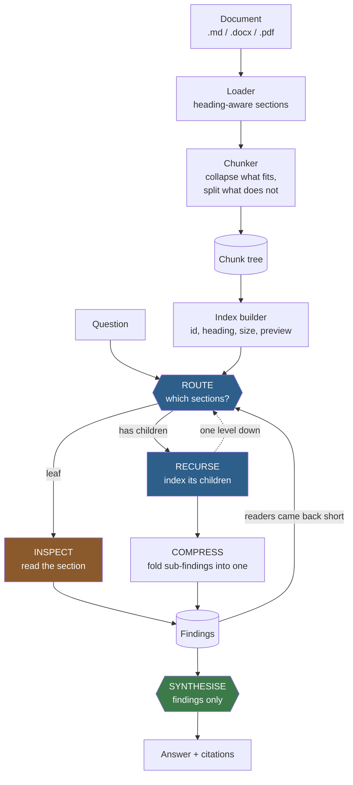
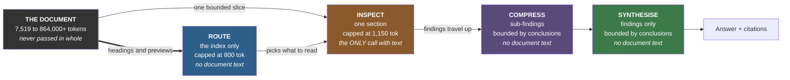
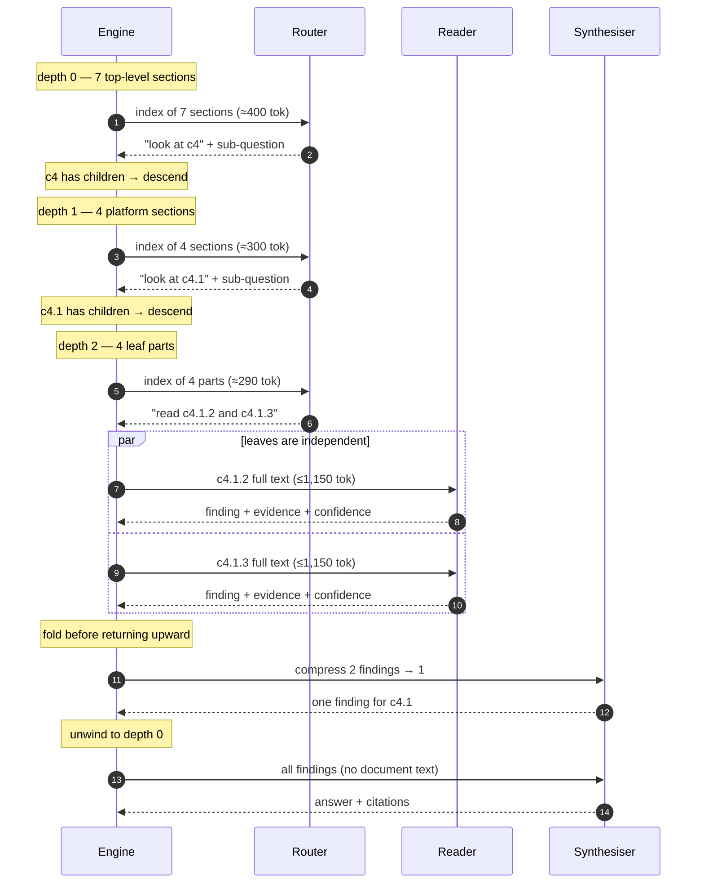
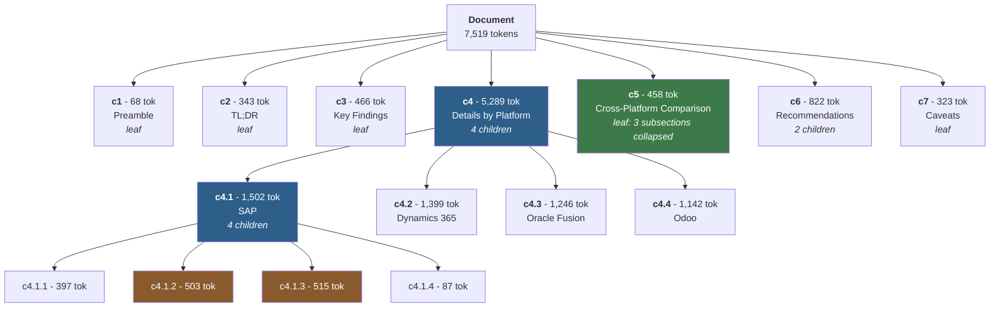

# RLM — a minimal Recursive Language Model

A small, readable implementation of one idea: **instead of pushing a whole document into a model's context, let the model navigate the document.**

The model never sees the document. It sees a *table of contents* — one line per section with an id, a heading path, a size and a short preview — and decides which sections are worth reading. A section small enough gets read in full. A section too big gets **descended into**, which repeats the same decision one level down. At the end, only the findings are combined into an answer.

Every reasoning step therefore happens in a **small, focused context**, no matter how large the input is.

> **This is an educational implementation.** It follows the RLM *idea* — recursive decomposition of a prompt the model treats as an environment rather than as tokens in its window — in a few hundred readable lines of Python. It is not a reimplementation of the paper's system, and it makes no benchmark claims of its own. See [Relationship to the paper](#relationship-to-the-paper).

---

## Contents

- [Background: the RLM paper](#background-the-rlm-paper)
- [Why this matters even when the document fits](#why-this-matters-even-when-the-document-fits)
- [The numbers](#the-numbers)
- [Architecture](#architecture)
  - [System overview](#system-overview)
  - [Context isolation — what each call sees](#context-isolation--what-each-call-sees)
  - [A recursive descent, step by step](#a-recursive-descent-step-by-step)
  - [The chunk tree](#the-chunk-tree)
  - [Module layout](#module-layout)
- [How the recursion works](#how-the-recursion-works)
- [The working context budget](#the-working-context-budget)
- [Install](#install)
- [Configuration](#configuration)
- [Running it](#running-it)
- [Tests](#tests)
- [Relationship to the paper](#relationship-to-the-paper)
- [Design decisions](#design-decisions)
- [Limitations](#limitations)
- [Where to take it next](#where-to-take-it-next)

---

## Background: the RLM paper

The concept comes from **"Recursive Language Models"** by Alex L. Zhang, Tim Kraska and Omar Khattab (MIT CSAIL), [arXiv:2512.24601](https://arxiv.org/abs/2512.24601) — see also the [author's write-up](https://alexzhang13.github.io/blog/2025/rlm/) and [reference implementation](https://github.com/alexzhang13/rlm).

Their framing, which is the part worth internalising:

> RLMs treat long prompts as part of an **external environment** and allow the LLM to programmatically examine, decompose, and recursively call itself over snippets of the prompt.

That is an epistemological shift, not a capacity trick. Context stops being *tokens inside the attention window* and becomes *data the model can operate on* — peek at it, partition it, search it, and spawn sub-calls over pieces of it.

---

## Why this matters even when the document fits

The naive reading of RLM is "a workaround for documents that are too big." That is the least interesting thing about it.

The real motivation is **context rot**: as the number of tokens in a context grows, a model's ability to accurately use information from it *degrades* — and that degradation begins **long before the window is full**. A model with a one-million-token window does not reason equally well over one million tokens as it does over ten thousand. The window is a capacity limit; it is not a quality guarantee.

So there are four independent reasons to reach for this, and only one of them is about capacity:

| Reason | Applies when the document fits? |
|---|---|
| **Accuracy** — small focused contexts avoid context rot | **Yes** — this is the main one |
| **Cost** — you pay for what was read, not for the whole document, on every question | **Yes** |
| **Auditability** — the trace records which sections were consulted and why | **Yes** |
| **Capacity** — inputs beyond any window | Only past the limit |

> A bigger context window raises the ceiling on what you *can* pass in. It does not remove the reason to pass in less.

### Compared to the alternatives

| | Whole document in the prompt | Flat RAG | RLM (this repo) |
|---|---|---|---|
| What the model sees first | everything | top-k chunks | a table of contents |
| Selection made by | — | vector similarity | the model, with a stated reason |
| Can it look again? | — | no | yes, bounded |
| Can it zoom in? | — | no | yes — that's the recursion |
| Context per reasoning step | the whole document | k chunks | one small section |
| Cost scales with | document size | k | what it chose to read |

The trade is real: an RLM spends **more model calls** in order to put **less in front of the model at each step**.

---

## The numbers

Two very different kinds of number follow, and they are kept apart on purpose.

### Reported in the paper

These are the authors' measured results, not this repository's. They are what motivates the design.

| Benchmark | Result |
|---|---|
| OOLONG, **132k-token split** — fits inside GPT-5's window | `RLM(GPT-5-mini)` beat GPT-5 by **over 34 points (~114% relative)**, at roughly the same API cost per query |
| OOLONG, 263k-token split | `RLM(GPT-5-mini)` beat GPT-5 by **over 15 points (~49% relative)** |
| BrowseComp-Plus, 1,000 documents | `RLM(GPT-5)` was the only configuration to **reach and hold perfect performance** at that scale |
| RLM-Qwen3-8B vs its base model | **+28.3% average** |
| Input length ceiling | up to **two orders of magnitude (100×)** beyond the model's context window |

The first row is the important one: a **smaller** model that could decompose the input beat a **larger** model handed the whole thing, on an input that comfortably fit in the larger model's window.

### Measured in this repository

These are structural properties of this implementation. They involve **no model calls at all**, so they are deterministic and reproducible on any machine:

```bash
python examples/measure_scaling.py
```

| Document size | Chunks | Routing context | As % of document |
|---:|---:|---:|---:|
| 1,728 tok | 4 | 204 tok | 11.81% |
| 5,184 tok | 32 | 392 tok | 7.56% |
| 17,280 tok | 100 | 680 tok | 3.94% |
| 77,760 tok | 420 | 794 tok | **1.02%** |
| 259,200 tok | 1,350 | 794 tok | **0.31%** |
| 864,000 tok | 4,400 | 794 tok | **0.09%** |

The routing context **stops growing**. Past roughly 78k tokens it sits at the configured cap and stays there, so a document 11× larger costs the router nothing extra to reason over. Its cost is a function of *how many sections are shown*, not of document size — `O(entries)`, not `O(document)`.

Three hard bounds hold regardless of input size, at default settings:

| Bound | Value | Why it holds |
|---|---:|---|
| Routing context | ≤ **800 tok** | previews shrink 140 → 0 chars, entries drop last |
| Document text in any one call | ≤ **1,150 tok** | the inspect budget, enforced by truncation |
| Model calls per question | ≤ **25** | counted at a single site, unbypassable |

On the bundled sample document (7,519 tokens → 26 chunks, depth 3, 7 top-level entries), the routing context is **396 tokens — 5.3% of the document**.

> **What is deliberately absent:** any accuracy figure produced by this repository. Measuring answer quality needs a benchmark, which this repo does not yet have. The accuracy case rests on the paper's results, cited above. See [Limitations](#limitations).

---

## Architecture

### System overview



### Context isolation — what each call sees

This is the central architectural property, and the reason the design works at any scale. There are four kinds of model call, and **only one of them ever receives document text**:



Three of the four calls are bounded by *how much was concluded*, not by how much exists. Only `INSPECT` touches source text, and it is capped by construction. **No call's context grows with document size.**

### A recursive descent, step by step

How a question about a fact buried three levels deep is resolved. Each `ROUTE` sees a fresh, small index of just that level:



The compression step is what keeps this flat: a parent level's context does **not** grow with how much was read beneath it.

### The chunk tree

The loader produces heading-delimited sections; the chunker turns them into a tree by applying two rules — **collapse** what already fits, **split** what does not. For the bundled sample document:



Two things to read off it:

- **`c5` collapsed.** It has three subsections in the source, but the whole subtree fits the 600-token leaf target, so it became one leaf. Without this rule the index fills with wrapper headings that tell the router nothing.
- **`c4` split, twice.** At 5,289 tokens it is far past the target, so its children stay addressable — and `c4.1` at 1,502 tokens is still too big, so it splits again into paragraph-aligned parts. That second split is what creates depth 3.

Chunk ids are short, deterministic and hierarchical (`c4`, `c4.1`, `c4.1.2`). They appear verbatim in prompts, and long opaque ids measurably increase the rate at which a model invents one that does not exist.

### Module layout

```
app/
├── cli.py              argparse, REPL, output rendering
├── config.py           Settings dataclass; env + CLI overrides; key never logged
├── models.py           every dataclass: Chunk, Finding, TraceEvent, Stats, RLMResult
├── trace.py            Tracer -- emits [RLM] lines AND records the structured trace
├── llm/
│   ├── base.py         LLMClient protocol, JSON extraction ladder, repair retry
│   ├── openai_client.py  the only file that imports the OpenAI SDK
│   └── mock.py         test doubles + the offline client behind --mock
├── loaders/
│   ├── _structure.py   shared heading-stack logic + level normalisation
│   ├── markdown_loader.py   stdlib
│   ├── docx_loader.py       stdlib zipfile + ElementTree (no python-docx, no lxml)
│   └── pdf_loader.py        pypdf, best-effort structure
└── rlm/
    ├── tokens.py       tiktoken with an automatic chars/4 fallback
    ├── chunker.py      sections -> chunk tree
    ├── context.py      build_index() -- the compact TOC the router sees
    ├── retrieval.py    BM25-lite lexical pre-filter (no vector store)
    ├── prompts.py      all four prompts, in one place
    └── engine.py       route -> inspect -> recurse -> synthesise, and the guards
```

The engine depends on an `LLMClient` protocol with a single `generate` method. Nothing in `app/rlm/` imports a vendor SDK, which is why the entire test suite runs without one.

---

## How the recursion works

### 1. The document becomes a tree

- **Collapse** — a subtree that already fits `chunk_target_tokens` becomes one leaf.
- **Split** — a leaf still too big is cut along paragraph boundaries, then sentence boundaries, then whitespace. **Never mid-word.** Consecutive parts carry a small overlap so an argument cut in half stays readable.

### 2. The router sees an index, not the text

Each candidate section becomes one line built from these fields:

| Field | Purpose |
|---|---|
| `id` | short, stable handle the model refers back to (`c4.1`) |
| heading path | `Details by Platform > SAP` — the strongest relevance signal available |
| token count | lets the router judge whether an answer is likely to be *in there* or *under there* |
| shape | `leaf` or `N subsections` — tells it whether descending is even possible |
| preview | first ~140 characters, shrinking to fit the cap |

The router replies with JSON — ids plus a sub-question for each:

```json
{
  "reasoning": "SAP licensing details live under the per-platform breakdown",
  "selections": [
    {
      "chunk_id": "c4",
      "sub_question": "What does SAP charge for external system access?",
      "why": "per-platform detail"
    }
  ]
}
```

Ids it invents are **dropped in code, not trusted**. Ids already inspected are dropped. The list is truncated to `max_selections_per_round`.

### 3. Read, or descend

- Chunk has no children → **inspect** it. The only call carrying document text, bounded by construction.
- Chunk has children → **recurse**: build an index over *those* children and run the same loop at `depth + 1`.

A reader returns a structured finding, and is explicitly permitted to say it found nothing:

```json
{
  "found": true,
  "answer": "...",
  "evidence": ["verbatim quote"],
  "confidence": 0.85,
  "needs_more": false,
  "suggested_chunk_ids": ["c6"]
}
```

### 4. Look again if needed

If readers report `needs_more` or `found: false`, the level routes again over what remains — told what is already known, with any sections the readers pointed at pinned to the front. Bounded by `max_iterations`. This is what makes it a **search** rather than a single fan-out.

### 5. Synthesise

One final call over **the findings only**. If it fails to parse twice, the answer is assembled deterministically in Python from the findings rather than crashing.

### The guards

Three independent ways for a run to stop:

| Guard | Default | Stops |
|---|---:|---|
| `max_depth` | 3 | how far down |
| `max_iterations` | 2 | how many routing rounds per level |
| `max_llm_calls` | 25 | total spend |

The call budget is enforced in **exactly one place** — every model call passes through a single counting wrapper. There is no second code path that could forget.

---

## The working context budget

`max_context_tokens` is the most important setting, and easy to misread: **it is not your model's context window.** It is the *working set* — how much document text you are willing to put in front of the model in any one call.

You set it by the quality and cost you want, not by what the model would technically accept. A model advertising a million-token window will still reason more reliably over 2,000 focused tokens than over 200,000 diffuse ones, and this setting is how you choose which regime it works in.

The default is **1,500**. Raising it means fewer, larger calls; lowering it means more, smaller, sharper ones. Finding the right value for your documents is the main thing to experiment with.

Below that budget there is nothing to decompose, so the engine skips straight to a single direct call — a threshold, not a failure mode.

---

## Install

Python 3.11 or newer.

```bash
git clone https://github.com/mallahim-ai/RLM_proj.git
cd RLM_proj

python -m venv .venv
source .venv/bin/activate          # Windows PowerShell: .venv\Scripts\Activate.ps1

pip install -r requirements.txt
cp .env.example .env               # Windows: Copy-Item .env.example .env
```

Five dependencies: `openai`, `python-dotenv`, `tiktoken`, `pypdf`, and `pytest`. You can skip the API key entirely and run with `--mock`.

---

## Configuration

Every setting has a default, an `RLM_*` environment variable and a CLI flag. Precedence is **CLI flag > environment > default**. See [`.env.example`](.env.example) for the full list.

| Setting | Default | What it does |
|---|---:|---|
| `RLM_MODEL` | `gpt-4o-mini` | any chat model supporting JSON response format |
| `RLM_MAX_CONTEXT_TOKENS` | `1500` | **working context budget** — text per call. Not the model's window; see [above](#the-working-context-budget) |
| `RLM_CHUNK_TARGET_TOKENS` | `600` | target leaf size; drives how deep the tree gets |
| `RLM_CHUNK_OVERLAP` | `60` | carried between hard-split parts only |
| `RLM_MAX_DEPTH` | `3` | recursion guard |
| `RLM_MAX_ITERATIONS` | `2` | routing rounds per level |
| `RLM_MAX_LLM_CALLS` | `25` | total call budget per question |
| `RLM_PREFILTER_THRESHOLD` | `12` | above this many candidates, lexical scoring narrows first |
| `RLM_TOKENIZER` | `auto` | `heuristic` forces chars/4 and never touches the network |

`OPENAI_API_KEY` is unprefixed, by SDK convention. It is **never logged**: `Settings.__repr__` masks it, so neither a stray `print` nor an exception dump can leak it, and `.env` is gitignored. Contradictory settings fail at startup rather than mid-run.

---

## Running it

```bash
python -m app --mock                        # full recursive flow offline, no API key
python -m app --question "..."              # one question against the real model
python -m app                               # interactive (:help, :tree, :stats, :trace)
python -m app --show-tree                   # print the chunk tree and exit
python -m app --json --question "..."       # stdout is pure JSON; trace goes to stderr
python -m app --doc path/to/file.pdf --question "..."
```

Three scripts in [`examples/`](examples/):

| Script | Needs a key? | Purpose |
|---|---|---|
| `measure_scaling.py` | no | reproduces [the scaling table](#measured-in-this-repository) |
| `run_mock_demo.py` | no | end-to-end offline; also a CI smoke test |
| `run_erp_question.py` | yes | six question shapes — breadth, filtering, summarisation, comparison, a fact buried three levels deep, and one needing two distant sections combined |

Under `--mock`, the *reasoning* is a deterministic stand-in, but the chunking, indexing, routing, descent, budgets and token accounting are all real. It exists so the control flow can be inspected without an API key.

---

## Tests

```bash
pytest                  # 116 tests, fully offline, no API calls, no network
pytest -m integration   # the paid tests; needs OPENAI_API_KEY
```

The default run is free by construction: the `integration` marker is excluded in `pyproject.toml`, and `conftest.py` pins the heuristic tokenizer so counts are deterministic and nothing fetches a BPE table.

| Area | Examples |
|---|---|
| Loading | heading paths; UTF-8 survival; `#` inside a code fence; docx level normalisation; PDF heading heuristic |
| Chunking | deterministic ids; collapse; hard-split; overlap bounds; **no chunk cut mid-word**; unsplittable input still terminates |
| Index | stays under budget for 200 chunks; previews shrink before entries drop |
| Retrieval | heading terms outweigh body; prefilter fires only above threshold; pinned chunks never dropped |
| JSON | fenced, prose-wrapped and brace-in-string replies; one repair retry, then give up |
| Engine | base case is exactly one call; descent reaches depth 2; only findings travel upward |
| Guards | depth, iteration and call budgets each enforced independently |
| Resilience | malformed replies, **hallucinated chunk ids**, wrong JSON types, failed synthesis |
| OpenAI client | request construction and usage parsing, against a stubbed SDK |
| CLI | `--mock`, `--json` purity, exit codes, config errors, and `examples/` actually executing |

Engine tests drive the recursion with scripted clients, so they assert on *control flow* — how many calls, at what depth, in what order — rather than on model output.

---

## Relationship to the paper

This repo implements the RLM *idea*, not the paper's system:

| | Paper ([arXiv:2512.24601](https://arxiv.org/abs/2512.24601)) | This repo |
|---|---|---|
| Environment | a **Python REPL** with the context pre-loaded as a variable; the root LM writes code to peek, partition and grep it | a **structured index** over a heading tree; the root LM picks section ids via JSON |
| Flexibility | very high — arbitrary computation over the context | bounded — route, descend, re-route |
| Failure modes | code errors, unbounded loops | hallucinated ids (dropped in code), bad routing |
| Readability | a research system | ~700 lines meant to be read start to finish |
| Evaluation | OOLONG, BrowseComp-Plus and others, with cost/quality curves | none — no benchmark claims are made here |

The REPL approach is strictly more general; for the real thing use [their implementation](https://github.com/alexzhang13/rlm). The trade made here is deliberate — a fixed decomposition strategy is far easier to follow, test and reason about, which is the point of a teaching repo.

**No claim is made that this implementation reproduces the paper's quality or cost results.**

---

## Design decisions

**Lexical retrieval, not embeddings.** BM25 over the candidates at the current level is forty lines, needs no index to keep in sync and no embedding calls. Heading paths are dense summaries, so weighting their terms 3× is remarkably effective. Embeddings belong here only once this demonstrably stops working.

**`tiktoken` with a fallback, not just chars/4.** This project is *about* enforcing a token budget, so mis-measuring its own budget would undercut the point. But tiktoken fetches its table over the network on first use, so failure latches a heuristic permanently and logs once — a fresh clone with no connectivity still works.

**No `python-docx`.** A `.docx` is a zip of XML with explicit heading styles; `zipfile` plus `ElementTree` handles it in about thirty-five lines and zero dependencies. `python-docx` would have pulled in `lxml`, a multi-megabyte C extension.

**No `tenacity`.** The OpenAI SDK already retries connection errors, 429s and 5xx with backoff. The only retry added here is *semantic* — asking a model to repair malformed JSON — which a retry library cannot express anyway.

**Malformed model output is expected, not exceptional.** Four layers handle it: JSON response mode, an extraction ladder (raw → strip fences → balanced-brace scan), required-key validation, and one repair retry. After that it is **non-fatal**: a failed route ends that level and synthesis proceeds with whatever was found.

---

## Limitations

- **Structure-dependent.** The index is only as good as the headings. Markdown is ideal; a `.docx` with real heading styles is fine; a PDF is best-effort — no heading markup exists, so the loader infers from short title-cased lines and falls back to page boundaries when that inference fires too often. Unstructured text degrades this toward flat chunking. The paper's REPL approach is less exposed to this, since the root model can search rather than depend on given structure.
- **Latency, not just calls.** Sibling sections are inspected sequentially. Wall-clock is the real cost here; token cost is already favourable. Parallel inspection is the obvious fix.
- **The router can be wrong.** It chooses from headings and ~140-character previews. A fact under a misleading heading with an unrevealing opening may not be found. Hallucinated ids are dropped safely, but a *plausible wrong* choice is just a wrong answer.
- **No caching or persistence.** Every question re-chunks and re-routes from scratch. There is no database, by design.
- **Single document.** The engine navigates one document's tree; a large corpus would want another level above this one.
- **Findings are not cross-checked.** If two sections disagree, synthesis sees both and does its best. There is no contradiction detection.

---

## Where to take it next

Roughly in order of value per unit of added complexity:

1. **Parallel inspection** of siblings at a level — pure latency win, no accuracy change, no new dependency.
2. **A response cache** keyed on `(chunk_id, sub_question)`. SQLite, one table. Makes prompt iteration far cheaper.
3. **A search primitive** for the router — closer to the paper's REPL, letting it grep the document rather than relying only on the heading index. The biggest single step toward the paper's generality.
4. **Multi-document routing**: one more level of index, over files instead of sections. The engine is already recursive; this is mostly a loader change.
5. **Confidence-driven re-reading** — let a low-confidence finding trigger a targeted second look rather than the current binary `needs_more`.
6. **Streaming the trace to a UI**, since `RLMResult.trace` is already structured for it.

---

## License

MIT.
